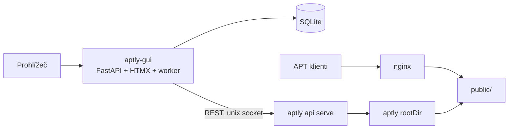

# aptly-gui — koncept

**Stav:** návrh v2, září 2026 • **Název:** pracovní

v2 zapracovává nálezy z PoC proti živému aptly 1.6.1 (`POC-NALEZY.md`). Přehled změn
proti v1 je na konci dokumentu.

## 1. Proč

Aptly umí mirrory Ubuntu a Debianu výborně, ale jen z příkazové řádky. V praxi to znamená skripty a cron, kterým rozumí jeden člověk. Otázky typu „z jakého snapshotu teď jede noble-security a kdy se naposled aktualizovalo" se řeší přes SSH. Aptly má REST API, ale bez autentizace, takže ho nejde jen tak dát kolegům.

Webových rozhraní pro aptly vzniklo několik, žádné se neudrželo a většina řeší lokální repozitáře a upload balíčků, ne správu mirrorů. Foreman obsah řeší přes Katello a Pulp, což je na „chci spravovat interní mirror Ubuntu" zbytečně těžké.

**aptly-gui** je lehké webové rozhraní nad aptly API, zaměřené na mirrory upstreamu: přehled, řízený cyklus sync → snapshot → publish, rollback a audit.

**Cílový uživatel:** sysadmin, který provozuje interní mirror Ubuntu/Debianu pro desítky až stovky serverů a chce aktualizace pouštět řízeně. Zmrazit stav, přepnout, případně vrátit.

Ten sysadmin má skoro jistě aptly už roky nasazený a obsluhovaný skripty. Nástroj, který
umí jen zelenou louku, je pro něj k ničemu — proto je adopce existujícího stavu (kap. 3)
hlavní cesta, ne doplněk.

## 2. Cíle a ne-cíle

Cíle v1:

1. Od `docker compose up` k funkčnímu GUI nad existujícím aptly do 10 minut.
2. Jedna obrazovka ukáže, co je publikované, z jakých snapshotů a jak staré jsou mirrory.
3. Aktualizace mirror setu (sync, snapshot, switch) jde spustit a sledovat bez SSH.
4. Vrácení publikace na předchozí snapshot je jedna akce.
5. Každá zápisová akce má v auditu autora a výsledek.
6. Existující mirrory jde převzít pod správu bez jejich přebudování.

Ne-cíle v1:

- **Nenahrazuje aptly a nečte jeho databázi.** Jediné rozhraní je REST API. PoC potvrdil, že
  to jde dodržet i pro údržbu — `POST /api/db/cleanup` je v API.
- **Lokální repozitáře a upload balíčků.** Jiný use case, přijde později.
- **Správa klientů.** Foreman spravuje hosty, tohle spravuje jen repozitáře.
- **Privátní GPG klíče.** Klíč žije na straně aptly, GUI zná jen jeho ID.
- **Víc aptly instancí, HA, Kubernetes operator.**

## 3. Hlavní pojmy

Aptly pracuje s mirrory, snapshoty a publikacemi po jednom. U Ubuntu je to hodně objektů: jeden release se 4 suites (base, updates, security, backports) a 4 komponentami je 16 mirrorů, 16 snapshotů a 4 publikace.

Proč 16 a ne 4: když publikuješ snapshot mirroru s více komponentami, aptly je sloučí do jedné. Aby klient viděl `main`, `universe` atd. odděleně, potřebuje každá komponenta vlastní mirror a publikace pak skládá komponenty z více snapshotů. To je nejčastější past a GUI ji má schovat.

### Mirror set

Jedna položka v GUI popisující upstream. Odpovídá zhruba „product" v Katellu.

| Pole | Příklad |
|---|---|
| name | `ubuntu-noble` |
| archive_url | `http://archive.ubuntu.com/ubuntu` |
| suites | `noble`, `noble-updates`, `noble-security`, `noble-backports` |
| components | `main`, `restricted`, `universe`, `multiverse` |
| architectures | `amd64` |
| filter | volitelný aptly filtr, např. pro demo jen `nginx` |
| keyring | veřejný klíč upstreamu pro ověření Release |
| publish | prefix (`ubuntu`), endpoint (`filesystem:…` nebo lokální), signing key ID |

GUI z něj vygeneruje aptly mirrory pojmenované `{set}-{suite}-{component}`.

Definice setu je **zdroj pravdy** a přehrává se při každé aktualizaci. Není to jen evidence:
PoC ukázal, že `PUT /api/mirrors/{name}` si nepamatuje `Keyrings` ze založení a bez jejich
opětovného poslání update spadne na ověření podpisu. Co GUI nepošle, to aptly neví.

### Snapshot set

Skupina snapshotů vytvořená jednou akcí ze všech mirrorů setu. Snapshoty mají jméno `{mirror}-{YYYYMMDDTHHMMZ}`, v DB je set jako celek. Publikace vždy ukazuje na snapshoty z jednoho snapshot setu, nikdy na mix z různých.

### Managed, unmanaged a adopce

Co GUI samo vytvořilo, eviduje v DB jako managed. Všechno ostatní v aptly zobrazí jako
unmanaged a nesahá na to.

Číst unmanaged objekty umí GUI od začátku — API je vrátí stejně jako `aptly mirror list`.
Co ale nejde, je je **řídit**. „Mirror set" existuje jen v DB GUI; aptly neví, že 16 mirrorů
patří k sobě, pod jakým prefixem a klíčem se publikují, ani že snapshoty z minulého úterý
vznikly jako jedna dávka. Bez toho seskupení nelze nabídnout ani Aktualizovat, ani Rollback,
protože není definované, co je „ten set" a kam se vracet.

**Adopce** je proto samostatná funkce: řekne GUI, že existující objekty tvoří set. Nic
nevytváří ani nemění, jen zapíše mapování. Od té chvíle se set chová jako založený z GUI.

Průvodce adopcí:

1. Vypíše unmanaged mirrory a seskupí kandidáty podle jmenné konvence a podle toho, na co
   odkazují existující publikace.
2. Nabídne „tohle vypadá jako set `ubuntu-noble`, sedí?" s možností ruční úpravy.
3. Po potvrzení dopíše chybějící části definice, které z aptly nejdou vyčíst — hlavně keyring
   a signing key ID.
4. Zkontroluje, že publikace ukazují na konzistentní sadu snapshotů, a co nesedí, označí
   jako drift.

Konvence `{set}-{suite}-{component}` je v praxi běžná (`ubuntu-noble-main`), takže
automatické seskupení pokryje většinu případů a ruční režim je záchranná brzda, ne norma.
Snapshoty založené před adopcí mají cizí pojmenování; GUI je nepřejmenovává, jen si k setu
poznamená, že historie před adopcí nemá strukturu snapshot setů.

## 4. Architektura



- **aptly-gui** je jeden proces a jeden kontejner: FastAPI, HTML šablony, background worker, SQLite.
- **Aptly API** běží tam, kde aptly, ideálně na unix socketu. Pokud se vedle GUI dál používá CLI nebo cron, API musí běžet s `-no-lock`.
- **APT klienty** dál obsluhuje nginx nad `public/`. GUI do toho nesahá a jeho pád klienty neovlivní.
- **Dlouhé operace:** každý krok je async volání aptly (`?_async=1`). GUI uloží ID aptly tasku, polluje stav a výstup a řídí pořadí kroků. Práci dělá aptly, GUI drží pořadí a historii.

### Souběh

Ve v1 běží **nejvýš jeden zápisový job na celou aptly instanci**, ostatní čekají ve frontě.
Ne jeden na mirror set: aptly má jednu databázi a s `-no-lock` by dva souběžné sety znamenaly
dva zapisovatele nad ní. Jemnější granularita je optimalizace do v0.3, až bude čím doložit,
že je bezpečná. Levné teď, drahé po první rozbité databázi.

Proti tomu, co někdo dělá z CLI mimo GUI, se bránit nelze. Patří do dokumentace.

### Zotavení po přerušení

Task fronta aptly je v paměti a **restart `aptly api serve` ji zahodí** — ověřeno, po restartu
vrací `/api/tasks` prázdné pole a konkrétní ID končí na 404. Dohledání podle uložených task ID
proto není spolehlivé a nesmí být na něm postavené zotavení.

Po restartu dostane job stav `interrupted` a worker **odvodí skutečnost z aptly**: existuje
očekávaný snapshot, má mirror aktuální `LastDownloadDate`, ukazuje publikace na očekávané
snapshoty. Teprve pak rozhodne operátor. Publish se nikdy neopakuje automaticky.

Tahle porovnávací funkce je jádro nástroje a používá se na třech místech: preflight (kap. 7,
krok 1), zotavení po přerušení a zobrazení driftu na dashboardu. Píše se jednou.

### Nasazení

K existujícímu aptly přibude jeden kontejner, nebo jeden proces, pokud někdo nechce Docker. Worker běží ve stejném procesu jako web, SQLite je soubor na volume. Žádný Redis, Celery, Postgres ani samostatný frontend.

```yaml
services:
  aptly-gui:
    image: ghcr.io/<user>/aptly-gui:latest
    ports: ["127.0.0.1:8080:8080"]
    environment:
      APTLY_API_SOCKET: /run/aptly/aptly.sock
    volumes:
      - gui-data:/data
      - /run/aptly:/run/aptly
volumes:
  gui-data:
```

Port je ve výchozím stavu na loopbacku. GUI má práva na celou aptly instanci a nemá TLS,
takže vystavení do sítě patří za reverzní proxy — README to musí říct, ne naznačit.
Formuláře jsou chráněné CSRF tokenem od první zápisové funkce; dodělávat to zpětně přes
všechny HTMX endpointy je otrava.

Vědomé omezení: kvůli workeru v procesu a SQLite běží vždy jen jedna instance. U nástroje pro jeden aptly server není co škálovat.

Demo compose v repu (`demo/`) staví vlastní aptly image z `debian:trixie-slim`, protože
oficiální image neexistuje. Zároveň tím vzniká pinning verze pro testovací matici.

## 5. Stack

| Část | Volba |
|---|---|
| Backend | Python 3.12+, FastAPI |
| Aptly klient | httpx (async, umí unix socket) |
| DB | SQLite přes SQLAlchemy 2 + Alembic. Postgres jde přidat později bez přepisu. |
| UI | Jinja2 šablony + HTMX, bez SPA a bez JS build pipeline |
| Auth | lokální uživatelé (argon2), role viewer / operator / admin; volitelně trusted header za oauth2-proxy |
| Balení | jeden multi-arch Docker image v GHCR |
| Testy | pytest, integrační testy proti skutečnému aptly v kontejneru |

**Minimální verze aptly: 1.6.x.** To je to, co je v Debianu trixie, a na čem běžel PoC.
Swagger spec aptly nevystavuje (404 na všech obvyklých cestách), takže klient se píše proti
chování a jistotu dává jen integrační test proti konkrétní verzi.

**Proč Python a ne Go:** s aptly se mluví přes HTTP, takže jazyk o integraci nerozhoduje. Hlavní výhoda Go, jedna binárka, tady nehraje roli, protože distribuce je Docker image. Python je rychlejší na iterace.

**Proč HTMX a ne React:** jeden jazyk, jeden kontejner, žádná generace API klienta, žádný npm v CI. Progress jobu stačí polling fragmentu stránky každé 2 s. Kdyby UI jednou HTMX přerostlo, JSON API vznikne tak jako tak (v0.2).

## 6. Datový model

| Tabulka | Obsah |
|---|---|
| `users` | login, hash hesla, role, aktivní |
| `mirror_sets` | definice setu (pole z kapitoly 3), revize, zda vznikl adopcí |
| `snapshot_sets` | set, časová značka, seznam snapshotů, job, který ho vytvořil, stav `complete/incomplete` |
| `jobs` | typ, cíl, stav, autor, začátek, konec, chyba |
| `job_steps` | job, pořadí, popis, aptly task ID, stav, konec výstupu |
| `audit_log` | kdo, kdy, akce, cíl, výsledek |

Stavy jobu: `queued`, `running`, `succeeded`, `failed`, `interrupted`. Víc zatím není potřeba.

Aptly task ID se ukládá kvůli auditu a čtení výstupu za běhu, ne jako podklad pro zotavení —
po restartu aptly přestane platit.

## 7. Workflow „Aktualizovat mirror set"

| Krok | Aptly API | Při chybě |
|---|---|---|
| 1. Preflight | `GET /api/version`, existence mirrorů a publikací; publikace musí ukazovat na snapshoty tohoto setu | Stop. Publikace ukazující jinam = drift, GUI ji neopravuje. |
| 2. Sync | `PUT /api/mirrors/{name}` async, mirrory postupně, vždy s celou definicí včetně `Keyrings` | Stop, nic se nepublikuje. |
| 3. Snapshot | `POST /api/mirrors/{name}/snapshots` pro každý mirror | Stop, set zůstane `incomplete` a nepublikuje se. |
| 4. Diff | `GET /api/snapshots/{new}/diff/{current}` | Jen souhrn: přidáno / odebráno / změněno po komponentách. |
| 5. Potvrzení | — | Operátor vidí diff a potvrdí. V configu jde nastavit auto-switch. |
| 6. Switch | pro každou suite zvlášť: první publikace `POST /api/publish/{prefix}`, další `PUT /api/publish/{prefix}/{distribution}` s mapou komponenta → snapshot | Stop. Job ukáže, které suites už přešly (částečná publikace). |
| 7. Ověření | `GET /api/publish` a porovnání s očekávanými snapshoty | Job `failed`, stav publikací v detailu. |

Pořadí suites při switchi: base, updates, security, backports.

Ke kroku 6: suite je samostatná publikace (`distribution`), komponenta je položka v mapě
uvnitř jednoho volání. U Ubuntu se 4 suites a 4 komponentami to znamená 4 volání, každé se
4 snapshoty. Míchání těch dvou pojmů je zdroj chyb.

Pár věcí, které musí UI říkat na rovinu:

- Switch není atomický přes všechny suites. Mezi prvním a posledním může klient chvíli vidět mix starého a nového.
- Úspěšné API volání ještě neznamená funkční repo pro klienty. HTTP kontrola `InRelease` a podpisu je P1.
- Nedostupné aptly API nesmí vypadat jako prázdný repozitář. Data se ukazují s časem posledního načtení a označením „zastaralé". Na rozlišení slouží `GET /api/ready` a `GET /api/healthy`.
- Chyby ověření podpisu aptly vrací jako holé `exit status 2`. GUI je musí přeložit — typicky jde o keyring, který neobsahuje klíč podepisující Release. Keyring proto patří do výběru s rozumnými přednastaveními, ne do textového pole.

### Nedokončený snapshot set

Když krok 3 selže u devátého z šestnácti mirrorů, zůstane devět managed snapshotů, které
nikam nepatří. Set zůstává `incomplete`, nepublikuje se a v UI nabízí dvě akce: zopakovat od
neúspěšného mirroru, nebo celý set zahodit. Zahození maže jen managed a nepublikované
snapshoty. Bez tohoto pravidla se sirotci hromadí a berou místo.

### Rollback

Vybereš starší snapshot set a proběhne krok 6 s jeho snapshoty. Protože aptly snapshoty jsou neměnné, je to levné a spolehlivé. Rollback nevrací balíčky, které si klienti mezitím nainstalovali; jen jim zpřístupní starší index.

### Úklid místa

Smazání snapshotu neuvolní žádné místo — data drží pool, dokud neproběhne
`POST /api/db/cleanup`. Retence tedy má dvě fáze: smazat managed a nepublikované snapshot
sety podle pravidla, pak spustit cleanup jako výlučný údržbový job. Volné místo se čte
z `GET /api/storage`.

Smazání publikovaného snapshotu si aptly hlídá samo (`unable to drop: snapshot is published`),
takže kontrolu není potřeba duplikovat, jen chybu srozumitelně zobrazit.

## 8. Obrazovky

- **Dashboard:** mirror sety, stáří posledního syncu, aktuálně publikovaný snapshot set, běžící job, poslední chyba, drift a volné místo.
- **Mirror set detail:** matice suites × komponenty se stavem mirrorů, historie snapshot setů, tlačítka Aktualizovat a Rollback.
- **Snapshoty:** sety a jednotlivé snapshoty, managed/unmanaged, kde jsou publikované.
- **Publikace:** prefix, distribution, architektury, která komponenta ukazuje na který snapshot.
- **Adopce:** unmanaged mirrory, návrh seskupení do setů, potvrzení.
- **Balíčky:** hledání balíčku napříč snapshoty („kde je jaká verze openssl").
- **Joby:** seznam a detail s kroky a výstupem aptly tasků.
- **Audit a uživatelé:** jen admin.

Drift je na dashboardu první třídy, ne až výsledek preflightu. Když publikace ukazuje na
snapshot z žádného známého setu, musí to být vidět hned — jinak cíl „jedna obrazovka ukáže,
co je publikované" neplatí právě v situaci, kdy na tom nejvíc záleží.

Stav vždy textem i ikonou, ne jen barvou. Časy uložené v UTC, zobrazené lokálně.

## 9. Roadmapa

**v0.0 — PoC. Hotovo.** Ověřeno proti aptly 1.6.1: založení filtrovaného mirroru, async update
s pollingem tasku, snapshot, publikace s podpisem, přepnutí a rollback. Nálezy a demo
prostředí jsou v `POC-NALEZY.md` a `demo/`.

**v0.1 — read-only přehled.** Dashboard, mirrory, snapshoty, publikace, drift, volné místo.
Lokální přihlášení, Docker image, demo compose. *Hotovo, když* si to cizí člověk podle README
pustí do 10 minut.

Hledání balíčků a diff snapshotů se z v0.1 vypustily: jsou to dvě nejdražší položky a ani
jedna není potřeba k naplnění slibu „jedna obrazovka ukáže, co je publikované".

**v0.2 — řízené akce.** Adopce existujících mirrorů, mirror sety, workflow z kapitoly 7,
joby s průběhem, diff snapshotů, role, audit, rollback, JSON API. *Hotovo, když* integrační
test projde celý cyklus včetně adopce, rollbacku a chyby uprostřed syncu.

Adopce jde jako první zápisová funkce — v aptly nic nemodifikuje, takže je nejbezpečnější,
a bez ní je nástroj v reálném prostředí natrvalo read-only.

**v0.3 — provoz.** Plánovaný sync (jako „sync plans" ve Foremanu), retention starých snapshot
setů včetně `db cleanup`, obsazenost disku v čase, `/metrics` pro Prometheus, webhook
notifikace, HTTP kontrola publikace, hledání balíčků.

**Později:** lifecycle prostředí (stejný mirror publikovaný jako `test` a `prod` s různými snapshot sety a tlačítkem Promote), lokální repozitáře, OIDC, Helm chart, víc instancí.

## 10. Repo a CI od prvního commitu

- README, CONTRIBUTING a issue šablony v angličtině, jinak projekt mimo ČR nikdo nenajde.
- Licence MIT nebo Apache-2.0.
- GitHub Actions: ruff, typová kontrola, pytest, integrační testy proti aptly jako service containeru.
- Integrační testy proti pinnutým verzím aptly, minimálně nejnižší podporované a nejnovější. Klient se píše proti chování, ne proti specu, takže tohle je jediná pojistka proti tichému rozbití.
- Build multi-arch image do GHCR, verze z git tagů, changelog generovaný z commitů (Conventional Commits).
- Dependabot nebo Renovate.
- Demo compose v repu, na kterém se dělají screenshoty do README.

## 11. Ověřeno v PoC

Otevřené otázky z v1 mají odpovědi, podrobnosti v `POC-NALEZY.md`:

- **Async tasky** fungují od 1.6.1; stavy `0` zařazen, `1` běží, `2` úspěch, `3` chyba.
- **Obsazenost disku** vrací `GET /api/storage`, mount rootDir není potřeba.
- **Signing** stačí zadat jako `{"Signing":{"Batch":true,"GpgKey":"…"}}`, klíč bez hesla na straně aptly. Passphrase v requestu není potřeba.
- **Tasky restart nepřežijí**, proto zotavení podle skutečného stavu (kap. 4).
- **`db cleanup` je v API**, takže pravidlo „jen REST" platí i pro údržbu.
- **`Keyrings` se při `PUT` mirroru neuchová** a musí se posílat znovu.

Zbývá otevřené:

- **Název projektu.** `aptly-gui` i `aptly-web-ui` na GitHubu existují. Rozhodnout před v0.1, protože je v cestě k image v GHCR.
- Kódování prefixu v URL (`/` → `_`, `_` → `__`) u víceúrovňových prefixů; PoC běžel na jednoduchém.
- Chování `?_async=1` u velmi dlouhého syncu (hodiny) — jestli polling tasku nevyprší dřív než sync.
- Jak přesně adopce dopozná signing key ID u publikací, které GUI nezaložilo.

## Změny proti v1

| Kapitola | Změna |
|---|---|
| 1, 3, 9 | Adopce existujících mirrorů povýšena z „Později" na v0.2 a na hlavní cestu. Důvod: reálná prostředí jsou plná mirrorů ze skriptů; bez adopce zůstane nástroj navždy read-only. |
| 3 | Definice setu je zdroj pravdy a přehrává se při každém běhu, protože aptly si `Keyrings` nepamatuje. |
| 4 | Zotavení po přerušení odvozuje stav z aptly, ne z uložených task ID — fronta tasků restart nepřežije. |
| 4 | Zámek zápisů je globální na instanci, ne per-set. |
| 4 | Loopback jako výchozí bind, reverzní proxy a CSRF explicitně. |
| 5 | Minimální verze aptly 1.6.x, Swagger spec neexistuje. |
| 7 | Vyjasněn krok 6 (suite = publikace, komponenta = položka v mapě), přidán keyring do kroku 2, pravidlo pro nedokončený snapshot set, sekce o úklidu místa. |
| 8 | Drift a volné místo na dashboard, obrazovka Adopce. |
| 9 | v0.1 oříznuta o hledání balíčků a diff, oboje posunuto dál. |
| 11 | Otevřené otázky nahrazeny odpověďmi z PoC. |
