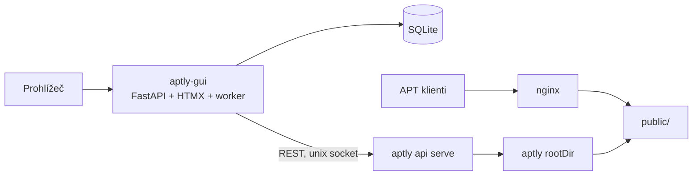

# aptly-gui — koncept

**Stav:** návrh v1, září 2026 • **Název:** pracovní

## 1. Proč

Aptly umí mirrory Ubuntu a Debianu výborně, ale jen z příkazové řádky. V praxi to znamená skripty a cron, kterým rozumí jeden člověk. Otázky typu „z jakého snapshotu teď jede noble-security a kdy se naposled aktualizovalo" se řeší přes SSH. Aptly má REST API, ale bez autentizace, takže ho nejde jen tak dát kolegům.

Webových rozhraní pro aptly vzniklo několik, žádné se neudrželo a většina řeší lokální repozitáře a upload balíčků, ne správu mirrorů. Foreman obsah řeší přes Katello a Pulp, což je na „chci spravovat interní mirror Ubuntu" zbytečně těžké.

**aptly-gui** je lehké webové rozhraní nad aptly API, zaměřené na mirrory upstreamu: přehled, řízený cyklus sync → snapshot → publish, rollback a audit.

**Cílový uživatel:** sysadmin, který provozuje interní mirror Ubuntu/Debianu pro desítky až stovky serverů a chce aktualizace pouštět řízeně. Zmrazit stav, přepnout, případně vrátit.

## 2. Cíle a ne-cíle

Cíle v1:

1. Od `docker compose up` k funkčnímu GUI nad existujícím aptly do 10 minut.
2. Jedna obrazovka ukáže, co je publikované, z jakých snapshotů a jak staré jsou mirrory.
3. Aktualizace mirror setu (sync, snapshot, switch) jde spustit a sledovat bez SSH.
4. Vrácení publikace na předchozí snapshot je jedna akce.
5. Každá zápisová akce má v auditu autora a výsledek.

Ne-cíle v1:

- **Nenahrazuje aptly a nečte jeho databázi.** Jediné rozhraní je REST API.
- **Lokální repozitáře a upload balíčků.** Jiný use case, přijde později.
- **Správa klientů.** Foreman spravuje hosty, tohle spravuje jen repozitáře.
- **Privátní GPG klíče.** Klíč žije na straně aptly, GUI zná jen jeho ID.
- **Víc aptly instancí, HA, Kubernetes operator.**

## 3. Hlavní pojmy

Aptly pracuje s mirrory, snapshoty a publikacemi po jednom. U Ubuntu je to hodně objektů: jeden release se 4 suites (base, updates, security, backports) a 4 komponentami je 16 mirrorů, 16 snapshotů a 4 publikace.

Proč 16 a ne 4: když publikuješ snapshot mirroru s více komponentami, aptly je sloučí do jedné. Aby klient viděl `main`, `universe` atd. odděleně, potřebuje každá komponenta vlastní mirror a publikace pak skládá komponenty z více snapshotů. To je nejčastější past a GUI ji má schovat.

### Mirror set

Jedna položka v GUI popisující upstream. Odpovídá zhruba „product" v Katellu.

| Pole | Příklad |
|---|---|
| name | `ubuntu-noble` |
| archive_url | `http://archive.ubuntu.com/ubuntu` |
| suites | `noble`, `noble-updates`, `noble-security`, `noble-backports` |
| components | `main`, `restricted`, `universe`, `multiverse` |
| architectures | `amd64` |
| filter | volitelný aptly filtr, např. pro demo jen `nginx` |
| keyring | veřejný klíč upstreamu pro ověření Release |
| publish | prefix (`ubuntu`), endpoint (`filesystem:…` nebo lokální), signing key ID |

GUI z něj vygeneruje aptly mirrory pojmenované `{set}-{suite}-{component}`.

### Snapshot set

Skupina snapshotů vytvořená jednou akcí ze všech mirrorů setu. Snapshoty mají jméno `{mirror}-{YYYYMMDDTHHMMZ}`, v DB je set jako celek. Publikace vždy ukazuje na snapshoty z jednoho snapshot setu, nikdy na mix z různých.

### Managed a unmanaged

Co GUI samo vytvořilo, eviduje v DB jako managed. Všechno ostatní v aptly (ručně založené mirrory, snapshoty ze starých skriptů) zobrazí jako unmanaged a nesahá na to. Adopce existujících mirrorů do setu je P1.

## 4. Architektura



- **aptly-gui** je jeden proces a jeden kontejner: FastAPI, HTML šablony, background worker, SQLite.
- **Aptly API** běží tam, kde aptly, ideálně na unix socketu. Pokud se vedle GUI dál používá CLI nebo cron, API musí běžet s `-no-lock`.
- **APT klienty** dál obsluhuje nginx nad `public/`. GUI do toho nesahá a jeho pád klienty neovlivní.
- **Dlouhé operace:** každý krok je async volání aptly (`?_async=1`). GUI uloží ID aptly tasku, polluje stav a výstup a řídí pořadí kroků. Práci dělá aptly, GUI drží pořadí a historii.
- **Souběh:** nejvýš jeden job na mirror set současně (zámek v SQLite). Ochrana proti tomu, co někdo dělá z CLI mimo GUI, není v moci GUI. Patří do dokumentace.
- **Restart GUI během jobu:** job dostane stav `interrupted`. Worker podle uložených task ID dohledá, jak kroky dopadly, a operátor rozhodne, co dál. Publish se nikdy neopakuje automaticky.

### Nasazení

K existujícímu aptly přibude jeden kontejner, nebo jeden proces, pokud někdo nechce Docker. Worker běží ve stejném procesu jako web, SQLite je soubor na volume. Žádný Redis, Celery, Postgres ani samostatný frontend.

```yaml
services:
  aptly-gui:
    image: ghcr.io/<user>/aptly-gui:latest
    ports: ["8080:8080"]
    environment:
      APTLY_API_SOCKET: /run/aptly/aptly.sock
    volumes:
      - gui-data:/data
      - /run/aptly:/run/aptly
volumes:
  gui-data:
```

Vědomé omezení: kvůli workeru v procesu a SQLite běží vždy jen jedna instance. U nástroje pro jeden aptly server není co škálovat.

Demo compose v repu má tři kontejnery (aptly, nginx, aptly-gui) jen proto, aby šel projekt vyzkoušet bez vlastního aptly.

## 5. Stack

| Část | Volba |
|---|---|
| Backend | Python 3.12+, FastAPI |
| Aptly klient | httpx (async, umí unix socket) |
| DB | SQLite přes SQLAlchemy 2 + Alembic. Postgres jde přidat později bez přepisu. |
| UI | Jinja2 šablony + HTMX, bez SPA a bez JS build pipeline |
| Auth | lokální uživatelé (argon2), role viewer / operator / admin; volitelně trusted header za oauth2-proxy |
| Balení | jeden multi-arch Docker image v GHCR |
| Testy | pytest, integrační testy proti skutečnému aptly v kontejneru |

**Proč Python a ne Go:** s aptly se mluví přes HTTP, takže jazyk o integraci nerozhoduje. Hlavní výhoda Go, jedna binárka, tady nehraje roli, protože distribuce je Docker image. Python je rychlejší na iterace.

**Proč HTMX a ne React:** jeden jazyk, jeden kontejner, žádná generace API klienta, žádný npm v CI. Progress jobu stačí polling fragmentu stránky každé 2 s. Kdyby UI jednou HTMX přerostlo, JSON API vznikne tak jako tak (v0.2).

## 6. Datový model

| Tabulka | Obsah |
|---|---|
| `users` | login, hash hesla, role, aktivní |
| `mirror_sets` | definice setu (pole z kapitoly 3), revize |
| `snapshot_sets` | set, časová značka, seznam snapshotů, job, který ho vytvořil, stav `complete/incomplete` |
| `jobs` | typ, cíl, stav, autor, začátek, konec, chyba |
| `job_steps` | job, pořadí, popis, aptly task ID, stav, konec výstupu |
| `audit_log` | kdo, kdy, akce, cíl, výsledek |

Stavy jobu: `queued`, `running`, `succeeded`, `failed`, `interrupted`. Víc zatím není potřeba.

## 7. Workflow „Aktualizovat mirror set"

| Krok | Aptly API | Při chybě |
|---|---|---|
| 1. Preflight | `GET /api/version`, existence mirrorů a publikací; publikace musí ukazovat na snapshoty tohoto setu | Stop. Publikace ukazující jinam = drift, GUI ji neopravuje. |
| 2. Sync | `PUT /api/mirrors/{name}` async, mirrory postupně | Stop, nic se nepublikuje. |
| 3. Snapshot | `POST /api/mirrors/{name}/snapshots` pro každý mirror | Stop, set zůstane `incomplete` a nepublikuje se. |
| 4. Diff | `GET /api/snapshots/{new}/diff/{current}` | Jen souhrn: přidáno / odebráno / změněno po komponentách. |
| 5. Potvrzení | — | Operátor vidí diff a potvrdí. V configu jde nastavit auto-switch. |
| 6. Switch | první publikace `POST /api/publish/{prefix}`, další `PUT /api/publish/{prefix}/{distribution}` se všemi 4 snapshoty | Stop. Job ukáže, které suites už přešly (částečná publikace). |
| 7. Ověření | `GET /api/publish` a porovnání s očekávanými snapshoty | Job `failed`, stav publikací v detailu. |

Pořadí suites při switchi: base, updates, security, backports.

Pár věcí, které musí UI říkat na rovinu:

- Switch není atomický přes všechny suites. Mezi prvním a posledním může klient chvíli vidět mix starého a nového.
- Úspěšné API volání ještě neznamená funkční repo pro klienty. HTTP kontrola `InRelease` a podpisu je P1.
- Nedostupné aptly API nesmí vypadat jako prázdný repozitář. Data se ukazují s časem posledního načtení a označením „zastaralé".

### Rollback

Vybereš starší snapshot set a proběhne krok 6 s jeho snapshoty. Protože aptly snapshoty jsou neměnné, je to levné a spolehlivé. Rollback nevrací balíčky, které si klienti mezitím nainstalovali; jen jim zpřístupní starší index.

## 8. Obrazovky

- **Dashboard:** mirror sety, stáří posledního syncu, aktuálně publikovaný snapshot set, běžící job, poslední chyba.
- **Mirror set detail:** matice suites × komponenty se stavem mirrorů, historie snapshot setů, tlačítka Aktualizovat a Rollback.
- **Snapshoty:** sety a jednotlivé snapshoty, managed/unmanaged, kde jsou publikované.
- **Publikace:** prefix, distribution, architektury, která komponenta ukazuje na který snapshot.
- **Balíčky:** hledání balíčku napříč snapshoty („kde je jaká verze openssl").
- **Joby:** seznam a detail s kroky a výstupem aptly tasků.
- **Audit a uživatelé:** jen admin.

Stav vždy textem i ikonou, ne jen barvou. Časy uložené v UTC, zobrazené lokálně.

## 9. Roadmapa

**v0.0 — PoC (1–2 víkendy).** Python skript bez UI, který přes aptly API založí malý filtrovaný mirror, async ho aktualizuje s pollingem tasku, udělá snapshot, publikuje a přepne. *Hotovo, když* celý řetězec projde proti aptly v Dockeru a víš, jaké verze aptly to vyžaduje.

**v0.1 — read-only přehled.** Dashboard, mirrory, snapshoty, publikace, hledání balíčků, diff dvou snapshotů. Lokální přihlášení, Docker image, demo compose (aptly + nginx + malý filtrovaný mirror Ubuntu). *Hotovo, když* si to cizí člověk podle README pustí do 10 minut.

**v0.2 — řízené akce.** Mirror sety, workflow z kapitoly 7, joby s průběhem, role, audit, rollback, JSON API. *Hotovo, když* integrační test projde celý cyklus včetně rollbacku a chyby uprostřed syncu.

**v0.3 — provoz.** Plánovaný sync (jako „sync plans" ve Foremanu), retention starých snapshot setů (maže jen managed a nepublikované), obsazenost disku, `/metrics` pro Prometheus, webhook notifikace, HTTP kontrola publikace.

**Později:** lifecycle prostředí (stejný mirror publikovaný jako `test` a `prod` s různými snapshot sety a tlačítkem Promote), adopce existujících mirrorů, lokální repozitáře, OIDC, Helm chart, víc instancí.

## 10. Repo a CI od prvního commitu

- README, CONTRIBUTING a issue šablony v angličtině, jinak projekt mimo ČR nikdo nenajde.
- Licence MIT nebo Apache-2.0.
- GitHub Actions: ruff, typová kontrola, pytest, integrační testy proti aptly jako service containeru.
- Build multi-arch image do GHCR, verze z git tagů, changelog generovaný z commitů (Conventional Commits).
- Dependabot nebo Renovate.
- Demo compose v repu, na kterém se dělají screenshoty do README.

## 11. Otevřené otázky pro PoC

- Od které verze aptly jsou v API async tasky? Z toho plyne minimální podporovaná verze.
- Umí API vrátit obsazenost disku? Pokud ne, volitelný read-only mount rootDir do kontejneru GUI.
- Signing přes API: stačí key ID v configu a passphrase přes gpg-agent na straně aptly, bez passphrase v requestu?
- Kódování prefixu v URL (`/` → `_`, `_` → `__`) a zápis endpointu `filesystem:{name}:{prefix}` v API.
- Přežije seznam aptly tasků restart `aptly api serve`? Ovlivňuje to dohledání stavu po `interrupted` jobu.
- Název projektu. `aptly-gui` a `aptly-web-ui` už na GitHubu existují.
